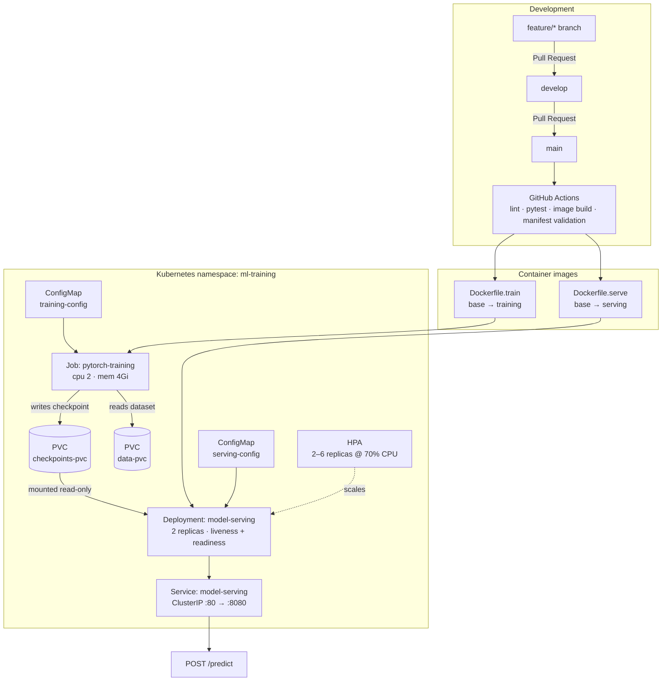

# mlops-pytorch-pipeline

A PyTorch image classifier taken through the full deployment lifecycle: local
development with a branch-and-PR Git workflow, multi-stage Docker builds for
training and serving, and Kubernetes orchestration with a batch Job for
training and a probed, autoscaled Deployment for inference.

---

## Architecture



The dependency that shapes the whole design is the checkpoint. Training is a
batch Job that terminates; serving is a long-lived Deployment. They are
decoupled by `checkpoints-pvc` — the Job mounts it read-write, the Deployment
mounts it read-only. Configuration flows the same way: one ConfigMap holds the
training hyperparameters as a YAML file mounted at `/app/configs`, another
holds the serving environment variables, so neither image needs a rebuild to
change a hyperparameter or a runtime setting.

---

## Repository layout

```
mlops-pytorch-pipeline/
├── README.md
├── Makefile                       # convenience targets for the verification loop
├── .gitignore                     # datasets, checkpoints and secrets stay out of git
├── .env.example                   # documents every variable; .env itself is ignored
├── .github/workflows/ci.yml       # lint · tests · image builds · manifest validation
├── src/
│   ├── model.py                   # ResNet-18 (CIFAR stem) and SimpleCNN
│   ├── dataset.py                 # transforms + DataLoader construction
│   ├── train.py                   # training loop, JSON-lines logging, early stopping
│   └── serve.py                   # FastAPI: /predict, /health, /ready, /metadata
├── configs/
│   ├── training_config.yaml       # full run
│   └── training_config.smoke.yaml # 2-epoch subset run for CI and verification
├── docker/
│   ├── Dockerfile.train           # multi-stage, deps cached separately from source
│   └── Dockerfile.serve           # inference deps only, non-root, HEALTHCHECK
├── k8s/
│   ├── namespace.yaml
│   ├── configmap.yaml             # training-config + serving-config
│   ├── secret.yaml                # placeholder, patched at deploy time
│   ├── storage.yaml               # data-pvc + checkpoints-pvc
│   ├── training-job.yaml
│   ├── training-job-gpu.yaml      # GPU variant with nodeSelector + toleration
│   ├── serving-deployment.yaml
│   ├── serving-service.yaml
│   └── hpa.yaml
├── requirements/
│   ├── train.txt                  # pinned training dependencies
│   ├── serve.txt                  # pinned inference dependencies
│   └── dev.txt                    # test and lint tooling
├── scripts/
│   └── make_test_image.py         # produces test_image.png for POST /predict
└── tests/
    ├── test_model.py
    ├── test_train.py
    └── test_serve.py
```

---

## Prerequisites

- Python 3.11
- Docker 24+
- `kubectl`, and a cluster (kind, Minikube, or a managed cluster)

---

## Quick start

```bash
# Unit tests
pip install -r requirements/dev.txt
pytest

# Build both images
docker build -f docker/Dockerfile.train -t mlops-train:v1 .
docker build -f docker/Dockerfile.serve -t mlops-serve:v1 .

# Train, with the dataset and checkpoints on mounted volumes
mkdir -p data checkpoints
docker run --rm \
  -v $(pwd)/data:/app/data \
  -v $(pwd)/checkpoints:/app/checkpoints \
  mlops-train:v1

# Serve the resulting checkpoint
docker run --rm -d --name mlops-serve -p 8080:8080 \
  -v $(pwd)/checkpoints:/app/checkpoints \
  mlops-serve:v1

curl http://localhost:8080/health
python scripts/make_test_image.py --out test_image.png --data-dir ./data
curl -X POST http://localhost:8080/predict -F "image=@test_image.png"
```

`make help` lists the same steps as targets.

### Overriding the config

`src/train.py` resolves its config in this order:

1. `TRAINING_CONFIG` environment variable
2. `/app/configs/training_config.yaml` — the ConfigMap mount in Kubernetes
3. `configs/training_config.yaml` — the repository copy

So a short run is a volume mount away, with no image rebuild:

```bash
docker run --rm \
  -v $(pwd)/data:/app/data \
  -v $(pwd)/checkpoints:/app/checkpoints \
  -v $(pwd)/configs/training_config.smoke.yaml:/app/configs/training_config.yaml:ro \
  mlops-train:v1
```

---

## API

| Method | Path        | Behaviour                                                    |
| ------ | ----------- | ------------------------------------------------------------ |
| `GET`  | `/health`   | Liveness — `200` whenever the process is serving HTTP          |
| `GET`  | `/ready`    | Readiness — `200` once a checkpoint is loaded, `503` if not    |
| `GET`  | `/metadata` | Architecture, dataset, training epoch, validation accuracy    |
| `POST` | `/predict`  | Multipart `image` upload; returns per-class probabilities     |

```json
{
  "filename": "test_image.png",
  "predicted_class": "cat",
  "probabilities": { "airplane": 0.0121, "automobile": 0.0043, "...": 0.0 },
  "top_k": [{ "class": "cat", "probability": 0.7412 }]
}
```

`/health` and `/ready` answer different questions, and the distinction matters.
A pod waiting for the training Job to write its checkpoint is *not ready*, but
it is *not broken* — pointing the liveness probe at a checkpoint-dependent
endpoint restarts it in a loop it can never escape. So `/health` reports that
the process is serving and `/ready` reports that a model is loaded, retrying the
load on each probe so a replica joins the Service on the first probe after the
checkpoint lands. `docs/evidence/VALIDATION.md` records both failures and their
fixes.

---

## Kubernetes deployment

```bash
kubectl apply -f k8s/namespace.yaml
kubectl apply -f k8s/configmap.yaml
kubectl apply -f k8s/storage.yaml
kubectl apply -f k8s/training-job.yaml

kubectl wait --for=condition=complete job/pytorch-training -n ml-training --timeout=30m
kubectl logs job/pytorch-training -n ml-training

kubectl apply -f k8s/serving-deployment.yaml
kubectl apply -f k8s/serving-service.yaml
kubectl apply -f k8s/hpa.yaml

kubectl get pods -n ml-training
kubectl describe deployment model-serving -n ml-training

kubectl port-forward svc/model-serving 8080:80 -n ml-training &
curl -X POST http://localhost:8080/predict -F "image=@test_image.png"
```

On a local kind cluster the images have to be side-loaded, since there is no
registry in the picture:

```bash
kind create cluster --name mlops
kind load docker-image mlops-train:v1 mlops-serve:v1 --name mlops
```

### Resource profile

| Workload         | CPU request | CPU limit | Memory request | Memory limit |
| ---------------- | ----------- | --------- | -------------- | ------------ |
| Training Job     | 2           | 2         | 4Gi            | 4Gi          |
| Serving replica  | 500m        | 1         | 1Gi            | 2Gi          |

`k8s/training-job-gpu.yaml` adds `nvidia.com/gpu: 1` with a
`accelerator: nvidia-gpu` node selector and a matching toleration.

---

## Secrets

No credential is committed. `k8s/secret.yaml` is a placeholder with empty
values; real ones are injected at deploy time:

```bash
kubectl create secret generic model-registry-credentials \
  --namespace ml-training \
  --from-literal=REGISTRY_USERNAME="$REGISTRY_USERNAME" \
  --from-literal=REGISTRY_TOKEN="$REGISTRY_TOKEN" \
  --dry-run=client -o yaml | kubectl apply -f -
```

`.gitignore` blocks `.env`, `*.pem`, `*.key`, `kubeconfig*` and `*-secret.yaml`.

---

## Git workflow

`main` is the release branch, `develop` integrates work, and every change
arrives through a feature branch merged by Pull Request. Commit messages follow
[Conventional Commits](https://www.conventionalcommits.org/).

```
main ── develop ── feature/pytorch-model
                ── feature/docker-training
                ── feature/k8s-deployment
                ── feature/e2e-validation
```

---

## Logging

`src/train.py` writes one JSON object per line to stdout, so `kubectl logs` is
directly parsable:

```json
{"event": "run_start", "device": "cpu", "architecture": "resnet18", "epochs": 10}
{"epoch": 1, "train_loss": 1.7421, "train_accuracy": 0.3612, "val_loss": 1.4103, "val_accuracy": 0.4835}
{"event": "checkpoint_saved", "path": "/app/checkpoints/classifier_v1.pt"}
{"event": "early_stopping", "epoch": 7, "patience": 3}
{"event": "training_complete", "best_val_loss": 0.6712}
```

```bash
kubectl logs job/pytorch-training -n ml-training | grep '"epoch"' | jq -r '[.epoch, .val_accuracy] | @tsv'
```
